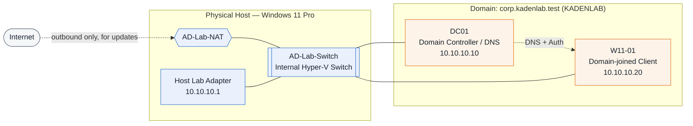

# Windows Active Directory Home Lab

A self-built Windows Server + Active Directory domain, run on Hyper-V, covering domain setup through the day-to-day work a help desk / Tier 1 role actually does: password policy, drive mapping, password resets, offboarding, and troubleshooting a real incident.

**Host:** Windows 11 Pro · Ryzen 5 7600X · 32GB RAM
**Domain controller:** `DC01` — Windows Server, `corp.kadenlab.test` (`KADENLAB`)
**Client:** `W11-01` — Windows 11, domain-joined

## Network

| Device | Role | IP Address |
|---|---|---|
| Host lab adapter | Hyper-V internal switch gateway | 10.10.10.1 |
| DC01 | Domain controller / DNS | 10.10.10.10 |
| W11-01 | Domain-joined client | 10.10.10.20 |

Isolated on an internal Hyper-V switch with NAT — the lab never touches the real home network. The dotted line from DC01 to W11-01 marks the logical relationship (DNS + domain authentication) on top of the physical connection through the switch.

## Documentation

1. [Hyper-V Setup](docs/01-hyper-v-setup.md) — enable Hyper-V, build the isolated lab network
2. [DC01 Setup](docs/02-dc01-setup.md) — create the server VM, rename it, set a static IP and DNS
3. [Active Directory Setup](docs/03-active-directory-setup.md) — promote to a domain controller, build the OU structure, create users and groups
4. [W11-01 Setup](docs/04-w11-01-setup.md) — build the client, join it to the domain, verify login
5. [Group Policy](docs/05-group-policy.md) — create, link, apply, and verify a baseline GPO
6. [Password and Lockout Policy](docs/06-password-lockout-policy.md) — harden the domain password policy, add account lockout
7. [Drive Mapping Policy](docs/07-drive-mapping-policy.md) — share a folder, auto-map it as a network drive via GPO
8. [Password Reset Runbook](docs/08-password-reset-runbook.md) — the standard procedure for the most common help desk ticket there is
9. [Offboarding Workflow](docs/09-offboarding-workflow.md) — disable vs. delete, group removal, data handling
10. [Troubleshooting Log](docs/10-troubleshooting-log.md) — problems I hit and how I fixed them, including a real domain admin lockout recovery

## Skills demonstrated

- Active Directory user, group, and OU management
- Domain controller promotion (AD DS) and DNS configuration/verification (`nslookup`)
- Joining a Windows client to a domain
- Group Policy: baseline computer policy, domain-wide password/lockout hardening, GPO drive mapping (user preferences)
- SMB share creation and the share-vs-NTFS permission model
- Password reset procedure with identity verification as the actual control
- User offboarding: disable-vs-delete, group cleanup, retention timelines
- Offline domain admin password recovery (`utilman.exe` swap method) after losing lab credentials
- Hyper-V virtual networking (internal switch + NAT), VM lifecycle troubleshooting
- PowerShell for Windows/AD administration throughout
- Troubleshooting and clear, structured documentation

## Why this maps to help desk work

| Lab work | Real-world equivalent |
|---|---|
| Password Reset Runbook | The single most common Tier 1 ticket, done with an actual identity-verification step, not just "type a new password" |
| Offboarding Workflow | Standard HR-driven account lifecycle work — disable/re-enable, group cleanup, retention policy |
| Password and Lockout Policy | Baseline security hardening every organization runs; explains *why* length beats complexity |
| Drive Mapping Policy | The GPO work behind "why can't I see the shared drive" tickets |
| Troubleshooting Log — DC recovery | A real incident: lost credentials, a false alarm about deleted VMs, and a documented, correct recovery — the kind of story that holds up in an interview because it actually happened |

## A note on how this was built

This documentation was written with the help of AI. The Active Directory lab itself — every VM, every command, every fix — was built and run by me.
