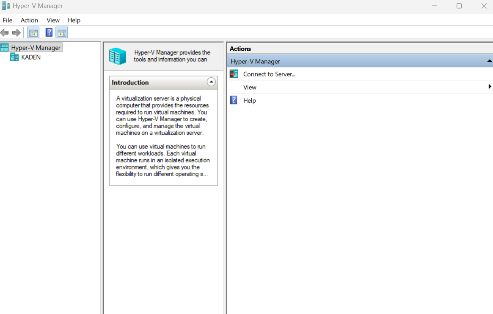
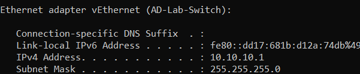
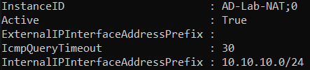

## Enable Hyper-V

Hyper-V is used to create and run the virtual machines for this Active Directory lab (see Lab Overview).

### Instructions

Open PowerShell as Administrator and run:

```powershell
Enable-WindowsOptionalFeature -Online -FeatureName Microsoft-Hyper-V -All
```

Restart the computer after the command finishes.

After restarting, open Hyper-V Manager.



---

## Create a Hyper-V Lab Network

The Active Directory lab uses an internal Hyper-V switch so the virtual machines can communicate with each other on a private lab network.

This keeps the domain lab separate from the normal home network.

### Instructions

Open PowerShell as Administrator and create an internal Hyper-V switch:

```powershell
New-VMSwitch -SwitchName "AD-Lab-Switch" -SwitchType Internal
```

Assign an IP address to the host lab adapter:

```powershell
New-NetIPAddress -IPAddress 10.10.10.1 -PrefixLength 24 -InterfaceAlias "vEthernet (AD-Lab-Switch)"
```

Create NAT for the lab network:

```powershell
New-NetNat -Name "AD-Lab-NAT" -InternalIPInterfaceAddressPrefix 10.10.10.0/24
```

### Network Layout

| Device | IP Address |
|---|---|
| Host lab adapter | 10.10.10.1 |
| [DC01](02-dc01-setup.md) | 10.10.10.10 |
| [W11-01](04-w11-01-setup.md) | 10.10.10.20 |

### Verification

Run the following commands:

```powershell
Get-VMSwitch
Get-NetNat
ipconfig
```

Confirm that:

- `AD-Lab-Switch` exists
- `AD-Lab-NAT` exists
- `vEthernet (AD-Lab-Switch)` has the IP address `10.10.10.1`





## What I Learned

In this section, I learned how to enable Hyper-V on Windows 11 Pro and create an isolated virtual network for lab machines.

I also learned how to verify the network using PowerShell commands such as `Get-VMSwitch`, `Get-NetNat`, and `ipconfig`.

This helped me understand why lab environments should be separated from a normal home network.

---

[Home](../README.md) · Next: [DC01 Setup](02-dc01-setup.md)
