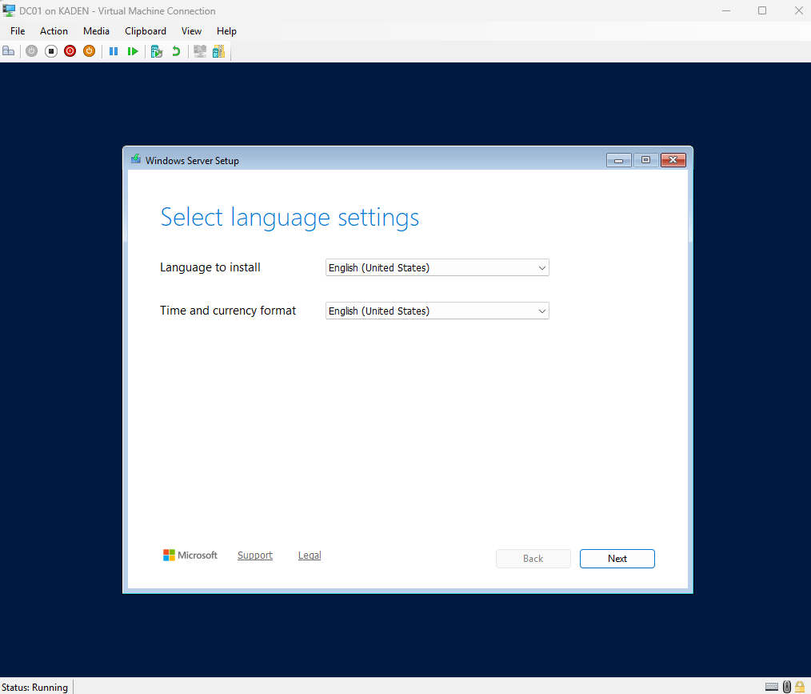
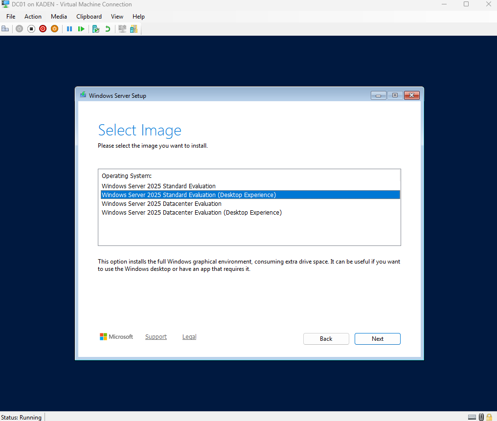
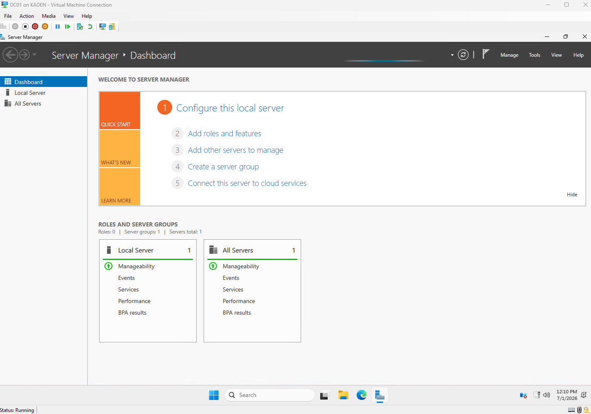
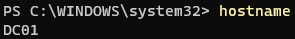
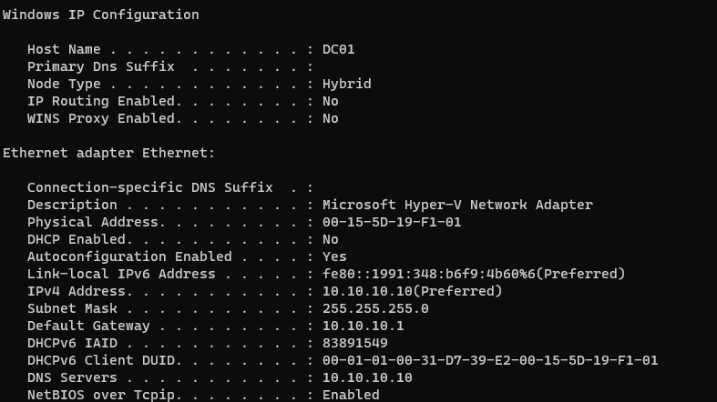

DC01 is the Windows Server virtual machine that will later become the domain controller for the Active Directory lab (see [Active Directory Setup](03-active-directory-setup.md)).

---

## Step 1: Create the DC01 Virtual Machine

### VM Settings

| Setting | Value |
|---|---|
| VM Name | DC01 |
| Generation | Generation 2 |
| Memory | 4096 MB |
| Network | AD-Lab-Switch |
| Virtual Hard Disk | 60 GB |
| Installation Media | Windows Server Evaluation ISO |
| Install Type | Desktop Experience |

### Instructions

Open Hyper-V Manager and create a new virtual machine named `DC01`.

Attach the virtual machine to the `AD-Lab-Switch` network (created in [Hyper-V Setup](01-hyper-v-setup.md)).

Use the Windows Server Evaluation ISO as the installation media.

During installation, choose the Windows Server option with `Desktop Experience`.

### Screenshots




The DC01 virtual machine was created in Hyper-V using the private lab switch.



This verifies that the `DC01` virtual machine was created and Windows Server installed successfully.

---

## Step 2: Rename the Server

Rename the server to `DC01`.

### Instructions

Open PowerShell as Administrator and run:

```powershell
Rename-Computer -NewName "DC01" -Restart
```

### Verification

Run:

```powershell
hostname
```

The output should show:



---

## Step 3: Set Static IP Address

DC01 was given a static IP address so it can be used as the domain controller and DNS server for the lab.

### Instructions

Open PowerShell as Administrator and run:

```powershell
New-NetIPAddress -InterfaceAlias "Ethernet" -IPAddress 10.10.10.10 -PrefixLength 24 -DefaultGateway 10.10.10.1
```

Set DC01 to use itself as the DNS server:

```powershell
Set-DnsClientServerAddress -InterfaceAlias "Ethernet" -ServerAddresses 10.10.10.10
```

### Verification

Run:

```powershell
ipconfig /all
```

Confirm the following settings:

| Setting | Value |
|---|---|
| Host Name | DC01 |
| IPv4 Address | 10.10.10.10 |
| Subnet Mask | 255.255.255.0 |
| Default Gateway | 10.10.10.1 |
| DNS Server | 10.10.10.10 |
| DHCP Enabled | No |

### Screenshot



This verifies that `DC01` has the static IP address `10.10.10.10`, uses `10.10.10.1` as the default gateway, and points to itself as the DNS server at `10.10.10.10`.

## What I Learned

In this section, I learned how to create a Windows Server virtual machine in Hyper-V and install Windows Server with Desktop Experience.

I also learned how to rename a server, assign a static IP address, and configure DNS settings.

This helped me understand why a domain controller needs a consistent IP address and why DNS is important in an Active Directory environment.

---

[Home](../README.md) · Prev: [Hyper-V Setup](01-hyper-v-setup.md) · Next: [Active Directory Setup](03-active-directory-setup.md)
