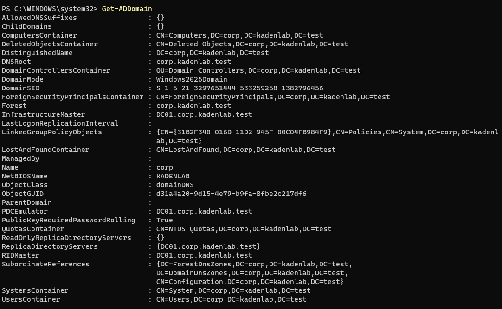
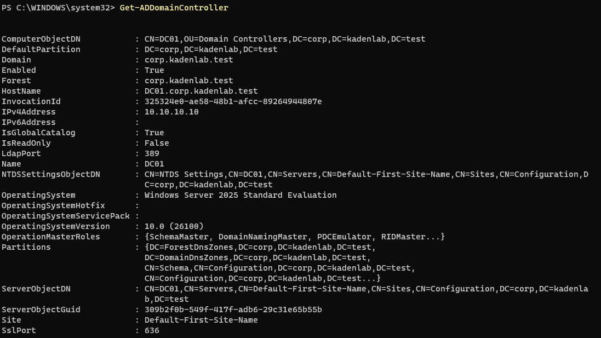
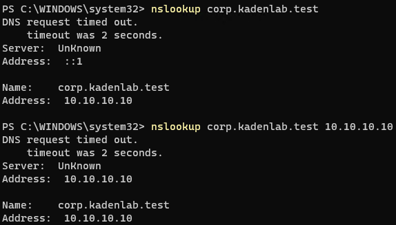
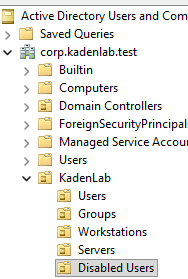
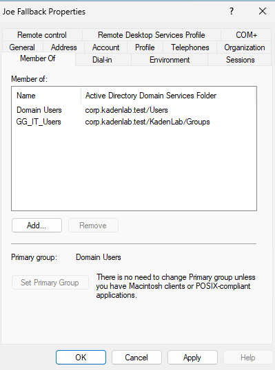

This section covers installing Active Directory Domain Services on [DC01](02-dc01-setup.md), promoting it to a domain controller, verifying the domain, creating an OU structure, and creating a test user and groups.

---

## Step 1: Install Active Directory Domain Services

Active Directory Domain Services was installed on `DC01` so the server could be promoted to a domain controller.

### Instructions

Open PowerShell as Administrator and run:

```powershell
Install-WindowsFeature AD-Domain-Services -IncludeManagementTools
```

Promote the server to a new forest:

```powershell
Install-ADDSForest `
  -DomainName "corp.kadenlab.test" `
  -DomainNetbiosName "KADENLAB" `
  -InstallDNS
```

During the promotion, create a DSRM password when prompted.

### DNS Delegation Warning

During the promotion, Windows displayed a DNS delegation warning.

This warning appeared because `corp.kadenlab.test` is a private lab domain and does not have a public parent DNS zone.

No action was required for this lab environment.

### Verification

After DC01 restarted, I logged in using the domain administrator account:

```text
KADENLAB\Administrator
```

---

## Step 2: Verify the Domain

After DC01 restarted, the domain was verified using PowerShell and DNS lookup commands.

### Verification Commands

Run:

```powershell
Get-ADDomain
```



Run:

```powershell
Get-ADDomainController
```



Run:

```powershell
nslookup corp.kadenlab.test 10.10.10.10
```



---

## Step 3: Create the OU Structure

Organizational Units were created to organize Active Directory objects such as users, groups, computers, servers, and disabled accounts.

### Instructions

Open Active Directory Users and Computers.

Create a main OU named:

```text
KadenLab
```

Inside `KadenLab`, create the following OUs:

```text
Users
Groups
Workstations
Servers
Disabled Users
```

### OU Structure

```text
corp.kadenlab.test
└── KadenLab
    ├── Users
    ├── Groups
    ├── Workstations
    ├── Servers
    └── Disabled Users
```

### Verification

Confirm that the `KadenLab` OU exists and contains the `Users`, `Groups`, `Workstations`, `Servers`, and `Disabled Users` OUs.



This screenshot verifies that the Active Directory OU structure was created successfully.

---

## Step 4: Create Groups and a Test User

Security groups and a test user were created to practice basic Active Directory user and group management.

### Groups Created

| Group Name | Group Scope | Group Type | Purpose |
|---|---|---|---|
| GG_IT_Users | Global | Security | General IT staff access; `jfb` is a member (see below) |
| GG_Helpdesk_Tier1 | Global | Security | Reserved for future Tier 1 delegated permissions — created but not yet assigned |

### Test User Created

| Setting | Value |
|---|---|
| First Name | Joe |
| Last Name | Fallback |
| Username | jfb |
| User Principal Name | jfb@corp.kadenlab.test |
| OU Location | Users |
| Group Membership | GG_IT_Users |

### Instructions

In Active Directory Users and Computers, create the security groups inside the `Groups` OU.

Create the test user `Joe Fallback` inside the `Users` OU.

Add `jfb` to the `GG_IT_Users` group.

### Verification

Run:

```powershell
Get-ADPrincipalGroupMembership jfb | Select-Object Name
```

Confirm that `jfb` is a member of:

```text
Domain Users
GG_IT_Users
```



## What I Learned

In this section, I learned how to install Active Directory Domain Services and change a Windows Server into a domain controller.

I also learned how to create a new domain, verify the domain controller, create Organizational Units, create security groups, and manage a test user account.

This helped me understand how Active Directory is used to organize users, groups, computers, and permissions in a Windows domain environment.

---

[Home](../README.md) · Prev: [DC01 Setup](02-dc01-setup.md) · Next: [W11-01 Setup](04-w11-01-setup.md)
