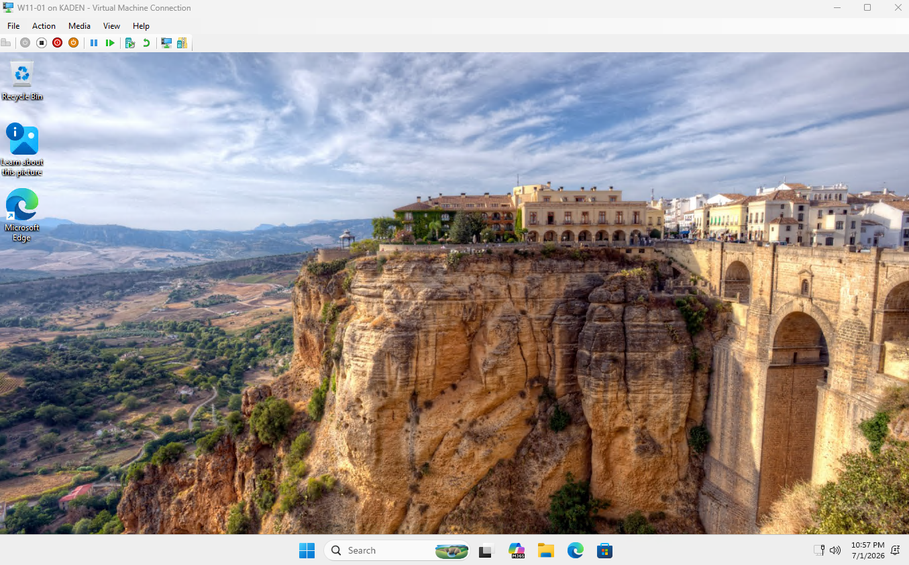
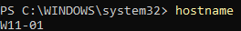
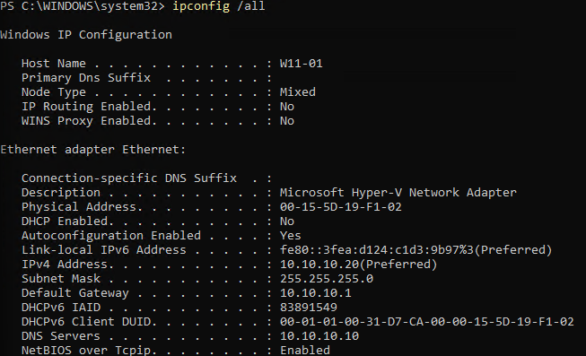
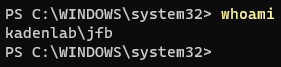
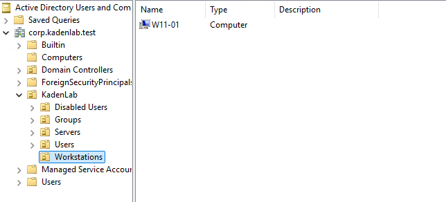

`W11-01` is the Windows 11 client virtual machine used to test domain joining, DNS, domain authentication, and [Group Policy](05-group-policy.md).

---

## Step 1: Create the W11-01 Virtual Machine

The Windows 11 client VM was created in Hyper-V and connected to the same lab network as [DC01](02-dc01-setup.md).

### VM Settings

| Setting | Value |
|---|---|
| VM Name | W11-01 |
| Generation | Generation 2 |
| Memory | 4096 MB |
| Network | AD-Lab-Switch |
| Virtual Hard Disk | 60 GB |
| Installation Media | Windows 11 ISO |

### Instructions

Create a new virtual machine in Hyper-V named `W11-01`.

Attach the VM to the `AD-Lab-Switch` network (created in [Hyper-V Setup](01-hyper-v-setup.md)).

Use the Windows 11 ISO as the installation media.

During setup, create a temporary local administrator account.

Ran into an issue during installation — see [Troubleshooting Log](10-troubleshooting-log.md).

### Screenshot



This shows that Windows 11 was installed successfully.

---

## Step 2: Verify the Computer Name

The Windows 11 client was named `W11-01` so it could be clearly identified in Active Directory.

### Verification

Run:

```powershell
hostname
```

Confirm that the output shows:

```text
W11-01
```

### Screenshot



---

## Step 3: Configure Static IP and DNS

`W11-01` was configured with a static IP address and pointed to `DC01` for DNS.

This is required so the client can locate the Active Directory domain.

### Instructions

Open PowerShell as Administrator and run:

```powershell
New-NetIPAddress -InterfaceAlias "Ethernet" -IPAddress 10.10.10.20 -PrefixLength 24 -DefaultGateway 10.10.10.1
```

Set the DNS server to `DC01`:

```powershell
Set-DnsClientServerAddress -InterfaceAlias "Ethernet" -ServerAddresses 10.10.10.10
```

### Verification

Run:

```powershell
ipconfig /all
```

Confirm the following settings:

| Setting | Value |
|---|---|
| Host Name | W11-01 |
| IPv4 Address | 10.10.10.20 |
| Default Gateway | 10.10.10.1 |
| DNS Server | 10.10.10.10 |

### Screenshot



This screenshot verifies that `W11-01` has the static IP address `10.10.10.20` and uses `DC01` at `10.10.10.10` as its DNS server.

---

## Step 4: Test Connectivity to DC01

Before joining the domain, network connectivity and DNS resolution were tested from `W11-01`.

### Verification

Run:

```powershell
ping 10.10.10.10
```

Then run:

```powershell
nslookup corp.kadenlab.test
```

Confirm that `W11-01` can reach `DC01` and resolve the domain name.

---

## Step 5: Join W11-01 to the Domain

`W11-01` was joined to the Active Directory domain `corp.kadenlab.test` (see [Active Directory Setup](03-active-directory-setup.md)).

### Instructions

Open PowerShell as Administrator and run:

```powershell
Add-Computer -DomainName "corp.kadenlab.test" -Restart
```

When prompted, enter domain administrator credentials:

```text
KADENLAB\Administrator
```

After the computer restarts, sign in using the test domain user:

```text
KADENLAB\jfb
```

### Verification

After signing in as the domain user, open normal PowerShell and run:

```powershell
whoami
```

The output should show:

```text
kadenlab\jfb
```

### Screenshot



This verifies that `W11-01` was joined to the domain and that the domain user `KADENLAB\jfb` was able to sign in successfully.

---

## Step 6: Move W11-01 to the Workstations OU

The computer object was moved into the `Workstations` OU created in [Active Directory Setup](03-active-directory-setup.md).

### Instructions

On `DC01`, open Active Directory Users and Computers.

Move `W11-01` to:

```text
corp.kadenlab.test
└── KadenLab
    └── Workstations
```

### Screenshot



This screenshot verifies that the `W11-01` computer object was moved into the `Workstations` OU.

---

## What I Learned

In this section, I learned how to create a Windows 11 client VM, configure its network settings, and join it to an Active Directory domain.

I also practiced verifying DNS, testing connectivity to a domain controller, signing in with a domain account, and organizing a domain-joined computer inside the correct OU.

This helped me understand how Windows workstations connect to and authenticate against an Active Directory domain.

---

[Home](../README.md) · Prev: [Active Directory Setup](03-active-directory-setup.md) · Next: [Group Policy](05-group-policy.md)
