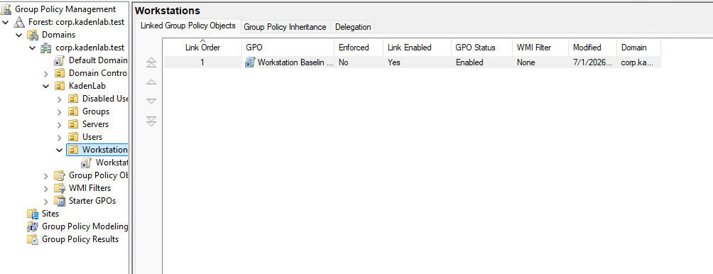
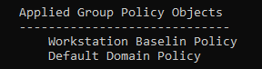
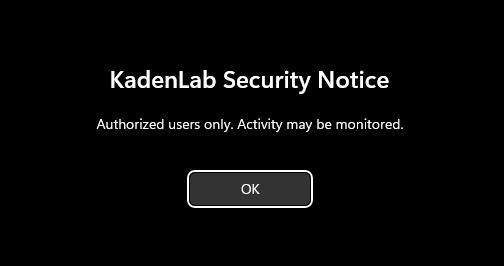

This section covers creating a basic Group Policy Object and applying it to the [W11-01](04-w11-01-setup.md) workstation.

---

## Step 1: Create the Workstation Baseline Policy

A Group Policy Object was created and linked to the `Workstations` OU (see [Active Directory Setup](03-active-directory-setup.md) for the OU structure).

### Instructions

On `DC01`, open Group Policy Management.

Navigate to:

```text
Forest: corp.kadenlab.test
└── Domains
    └── corp.kadenlab.test
        └── KadenLab
            └── Workstations
```

Right-click the `Workstations` OU and select:

```text
Create a GPO in this domain, and Link it here
```

Name the policy:

```text
Workstation Baseline Policy
```

### Screenshot



This verifies that the `Workstation Baseline Policy` GPO was created and linked to the `Workstations` OU.

---

## Step 2: Configure the Login Banner

The GPO was configured to display a security notice before users sign in.

### Instructions

Right-click the `Workstation Baseline Policy` and select:

```text
Edit
```

Navigate to:

```text
Computer Configuration
└── Policies
    └── Windows Settings
        └── Security Settings
            └── Local Policies
                └── Security Options
```

Configure the following settings:

| Policy Setting | Value |
|---|---|
| Interactive logon: Message title for users attempting to log on | KadenLab Security Notice |
| Interactive logon: Message text for users attempting to log on | Authorized users only. Activity may be monitored. |

---

## Step 3: Apply and Verify Group Policy

On `W11-01`, Group Policy was updated and verified using PowerShell.

### Instructions

Open PowerShell as Administrator and run:

```powershell
gpupdate /force
```

Then verify the applied computer policies:

```powershell
gpresult /r /scope computer
```

### Verification

Confirm that `Workstation Baseline Policy` appears under the applied Group Policy Objects.

### Screenshot



This verifies that the `Workstation Baseline Policy` was applied to `W11-01`.

---

## Step 4: Verify the Login Banner

After the policy was applied, `W11-01` displayed the configured login notice.

### Screenshot



This screenshot verifies that the Group Policy login banner was successfully applied to the domain-joined Windows 11 workstation.

---

## What I Learned

In this section, I learned how to create and link a Group Policy Object to an Organizational Unit in Active Directory.

I also practiced configuring a computer-based policy, forcing a Group Policy update with `gpupdate`, and verifying policy application with `gpresult`.

This helped me understand how Group Policy is used to manage Windows workstations in a domain environment.

---

[Home](../README.md) · Prev: [W11-01 Setup](04-w11-01-setup.md) · Next: [Password and Lockout Policy](06-password-lockout-policy.md)
