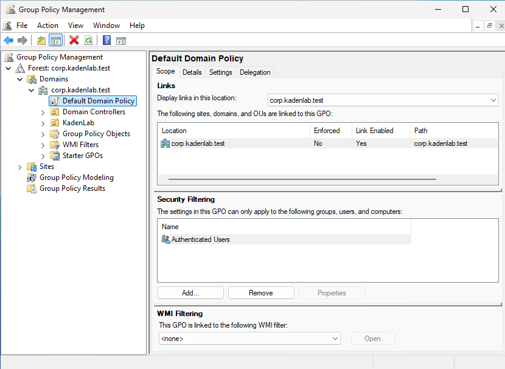
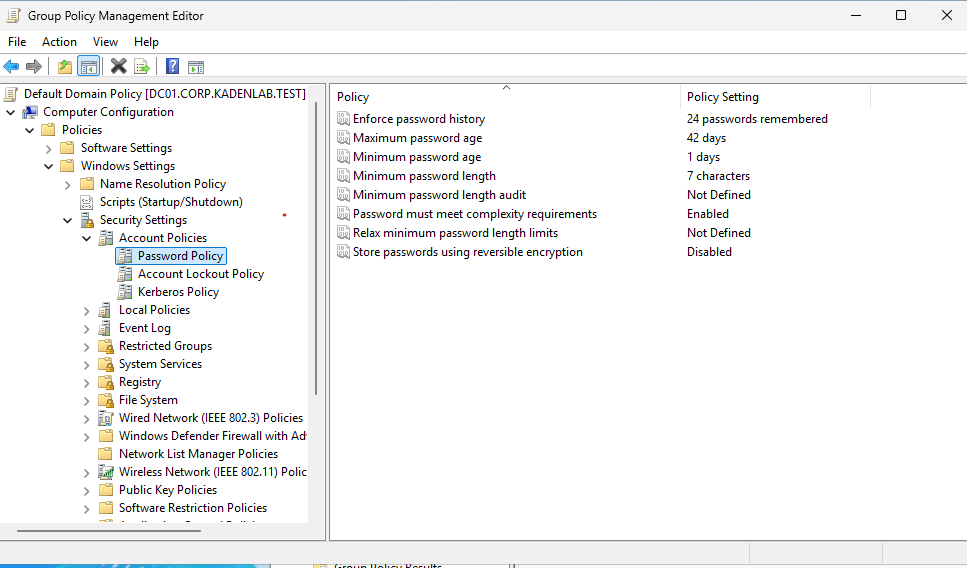
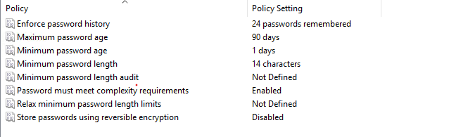
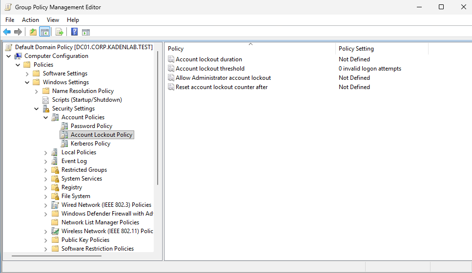
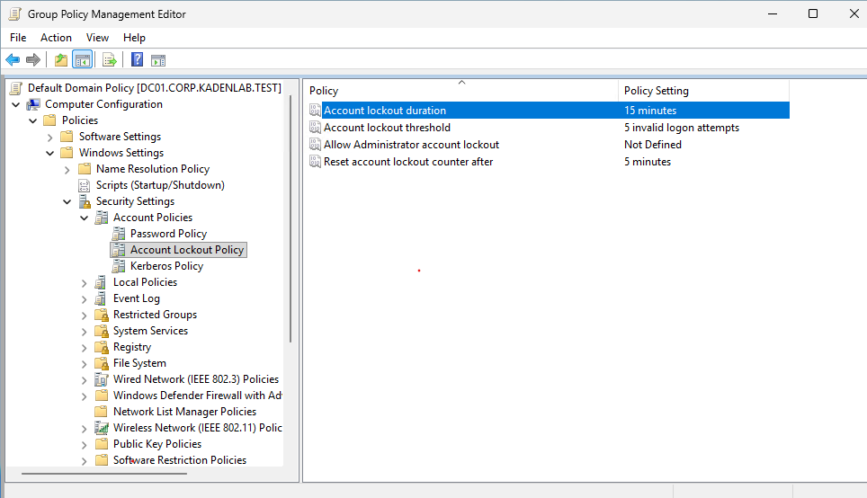

This section covers hardening the domain-wide **Password Policy** and **Account Lockout Policy** using the `Default Domain Policy` GPO. These settings only take effect at the domain level, not on an individual OU (see [Active Directory Setup](03-active-directory-setup.md) for the OU structure).

---

## Step 1: Open the Default Domain Policy

Password and lockout settings apply to every account in the domain, so they are configured in the `Default Domain Policy` GPO linked at the domain root.

### Instructions

On `DC01`, open Group Policy Management (`gpmc.msc`).

Navigate to:

```text
Forest: corp.kadenlab.test
└── Domains
    └── corp.kadenlab.test
        └── Default Domain Policy
```

Right-click `Default Domain Policy` and select:

```text
Edit
```

### Screenshot



This verifies the `Default Domain Policy` was opened for editing.

---

## Step 2: Review the Default Password Policy

The out-of-the-box defaults were reviewed before any changes were made.

### Instructions

In the Group Policy Management Editor, navigate to:

```text
Computer Configuration
└── Policies
    └── Windows Settings
        └── Security Settings
            └── Account Policies
                └── Password Policy
```

The default values were:

| Policy Setting | Default Value |
|---|---|
| Enforce password history | 24 passwords remembered |
| Maximum password age | 42 days |
| Minimum password age | 1 day |
| Minimum password length | 7 characters |
| Password must meet complexity requirements | Enabled |

### Screenshot



---

## Step 3: Harden the Password Policy

The password policy was raised from the lab defaults toward an enterprise baseline.

### Instructions

Double-click each setting, then set the value below:

| Policy Setting | New Value |
|---|---|
| Minimum password length | 14 characters |
| Maximum password age | 90 days |
| Password must meet complexity requirements | Enabled (unchanged) |
| Enforce password history | 24 passwords remembered (unchanged) |

### Screenshot



This verifies the minimum length was raised to 14 and the maximum age to 90 days.

**Note:** Password policy applies at the *next* password change, not retroactively. Existing shorter passwords keep working until they are changed.

---

## Step 4: Review the Default Lockout Policy

By default there is no account lockout, which allows unlimited password guessing.

### Instructions

Navigate to:

```text
Computer Configuration
└── Policies
    └── Windows Settings
        └── Security Settings
            └── Account Policies
                └── Account Lockout Policy
```

The default `Account lockout threshold` was `0 invalid logon attempts`, meaning **accounts never lock out**.

### Screenshot



---

## Step 5: Configure the Account Lockout Policy

A lockout threshold was set to limit password-guessing attempts.

### Instructions

Double-click `Account lockout threshold` and set it to `5`. Windows then prompts with **Suggested Value Changes** for the remaining settings; the suggested values were accepted and then adjusted.

Final values:

| Policy Setting | Value |
|---|---|
| Account lockout threshold | 5 invalid logon attempts |
| Account lockout duration | 15 minutes |
| Reset account lockout counter after | 5 minutes |
| Allow Administrator account lockout | Not Defined (left disabled) |

### Screenshot



This verifies the lockout threshold, duration, and reset window were configured.

---

## Step 6: Apply and Verify the Policy

Group Policy was forced to refresh and the effective policy was verified from the command line.

### Instructions

On `DC01`, open PowerShell and run:

```powershell
gpupdate /force
```

Then confirm the effective account policy:

```powershell
net accounts
```

### Verification

The `net accounts` output confirmed the domain is enforcing the new settings:

```text
Maximum password age (days):            90
Minimum password length:                14
Length of password history maintained:  24
Lockout threshold:                      5
Lockout duration (minutes):             15
Lockout observation window (minutes):   5
```

This verifies the password and lockout policy is live and enforced, not just saved in the editor.

---

## What I Learned

In this section, I learned that password and account lockout policies are enforced domain-wide through the `Default Domain Policy`, not on individual OUs.

I configured a stronger password policy (14-character minimum, 90-day maximum age) and added an account lockout policy (5 attempts, 15-minute lockout) to defend against brute-force password guessing.

I also learned that longer minimum length provides more protection than complexity rules alone because each added character increases the number of possible passwords exponentially, while complexity rules are often satisfied with predictable patterns.

Finally, I learned to force policy application with `gpupdate /force` and to verify the effective policy with `net accounts`, rather than assuming a saved GPO is already in effect.

---

[Home](../README.md) · Prev: [Group Policy](05-group-policy.md) · Next: [Drive Mapping Policy](07-drive-mapping-policy.md)

Related: [Troubleshooting Log](10-troubleshooting-log.md)
