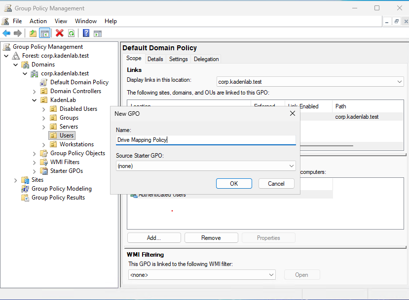
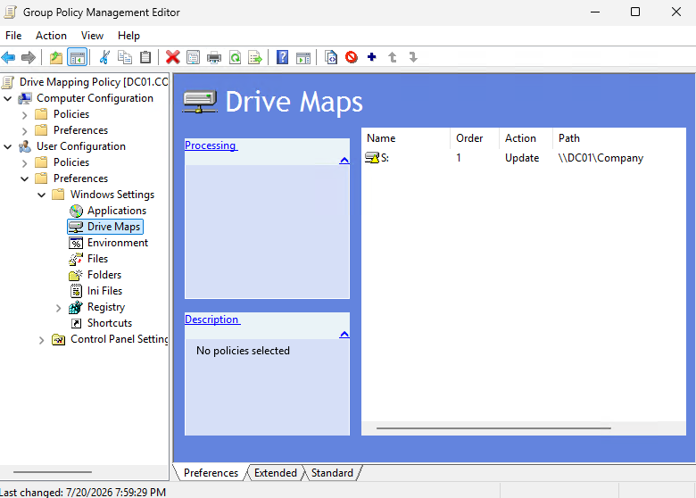
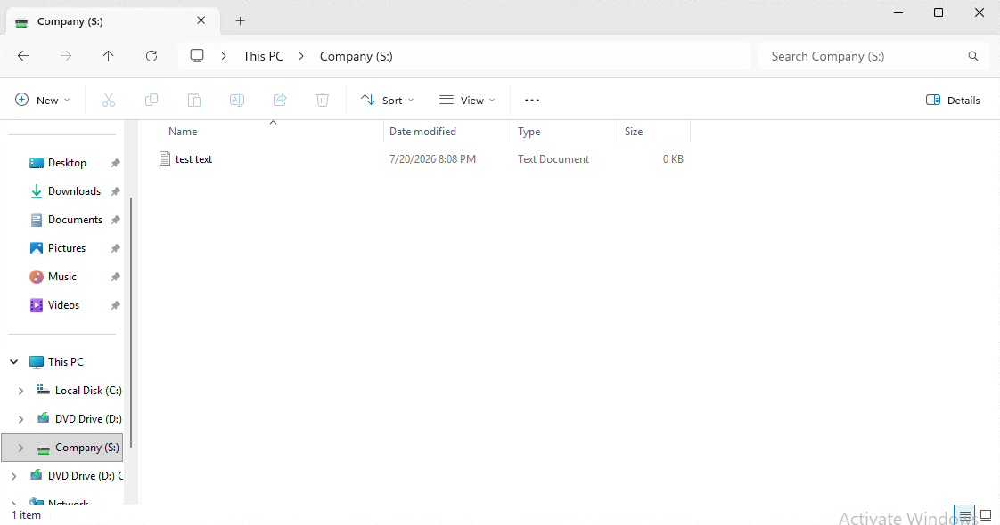

This section covers creating a shared folder on [DC01](02-dc01-setup.md) and using a Group Policy Preference to automatically map it as a network drive for domain users at logon. Unlike the [Password and Lockout Policy](06-password-lockout-policy.md) (a *computer* policy applied at the domain level), drive mapping is a *user* preference applied to an OU containing users.

---

## Step 1: Create and Share a Folder on DC01

A drive can only map to a share that exists, so a shared folder was created first.

### Instructions

On `DC01`, open PowerShell and run:

```powershell
New-Item -Path "C:\Shares\Company" -ItemType Directory -Force
New-SmbShare -Name "Company" -Path "C:\Shares\Company" -FullAccess "KADENLAB\Domain Admins" -ChangeAccess "KADENLAB\Domain Users"
Get-SmbShare -Name "Company"
```

This shares the folder as `Company`, reachable on the network as `\\DC01\Company`.

### Share vs NTFS Permissions

A shared folder has two independent permission layers:

- **Share permissions** apply only over the network (`\\DC01\Company`).
- **NTFS permissions** apply both over the network and locally, and can be set per file.

When they conflict, the **most restrictive** of the two wins. Standard practice is to leave share permissions open (Domain Users = Change) and control real access with NTFS.

---

## Step 2: Create and Link the Drive Mapping GPO

### Instructions

On `DC01`, open Group Policy Management (`gpmc.msc`).

Link a new GPO to the **Users** OU (drive mapping is a user setting and must apply to the OU containing the user accounts):

```text
corp.kadenlab.test
└── KadenLab
    └── Users
```

Right-click the `Users` OU → **Create a GPO in this domain, and Link it here**. Name it `Drive Mapping Policy`.

### Screenshot



### Verifying the Target User's Location

Before relying on the link, the test user's exact location was confirmed (a GPO only applies to users physically inside the linked OU):

```powershell
Get-ADUser jfb -Properties CanonicalName | Select-Object Name, CanonicalName, DistinguishedName
```

Result confirmed `jfb` is in `OU=Users,OU=KadenLab` (a real OU, not the built-in `Users` container, which cannot have GPOs linked).

---

## Step 3: Configure the Drive Mapping

### Instructions

Right-click `Drive Mapping Policy` → **Edit**, then navigate to (note: **Preferences**, not Policies):

```text
User Configuration
└── Preferences
    └── Windows Settings
        └── Drive Maps
```

Right-click **Drive Maps** → **New** → **Mapped Drive**, and configure:

| Field | Value |
|---|---|
| Action | Update |
| Location | `\\DC01\Company` |
| Reconnect | Checked |
| Label as | Company |
| Drive Letter | S: |

### Screenshot



**Action = Update** creates the drive if missing and repairs it if it already exists (safer than Create, which fails if the drive is already present).

---

## Step 4: Apply and Verify

Drive maps are a *user* setting and apply when the user logs on, so verification requires a fresh login as the target user.

### Instructions

If the test user's password is unknown, reset it from `DC01` first (it must now meet the hardened 14-character policy):

```powershell
Set-ADAccountPassword -Identity jfb -Reset -NewPassword (Read-Host -AsSecureString "New password for jfb")
Set-ADUser -Identity jfb -ChangePasswordAtLogon $false
```

Then on `W11-01`, **sign out** completely and log in as `KADENLAB\jfb`. Open **File Explorer → This PC**.

### Verification

An `S:` drive labeled **Company** appears under Network locations, pointing at `\\DC01\Company`. Creating a test file inside the drive confirms the mapping and the write permission end to end.



---

## What I Learned

In this section, I learned to create an SMB shared folder and map it as a network drive automatically using a Group Policy Preference.

I learned the difference between **share permissions** and **NTFS permissions**, and that the most restrictive of the two determines effective access.

Most importantly, I learned the difference between **computer** and **user** Group Policy settings: computer settings (like password policy) refresh in the background, but user settings (like drive maps) apply only when the user logs on, because a mapped drive is part of the user's session and the session is built at logon. This is why the drive did not appear until the test user signed in fresh.

I also confirmed the value of verifying a user's exact `DistinguishedName` before troubleshooting why a GPO is not applying.

---

[Home](../README.md) · Prev: [Password and Lockout Policy](06-password-lockout-policy.md) · Next: [Password Reset Runbook](08-password-reset-runbook.md)

Related: [Group Policy](05-group-policy.md) · [Active Directory Setup](03-active-directory-setup.md)
