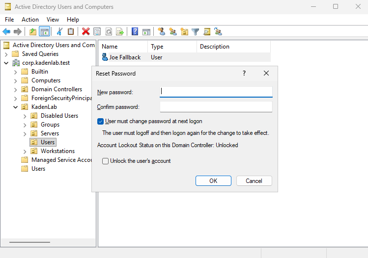
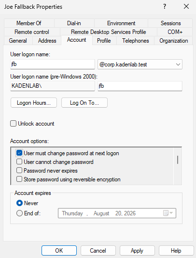
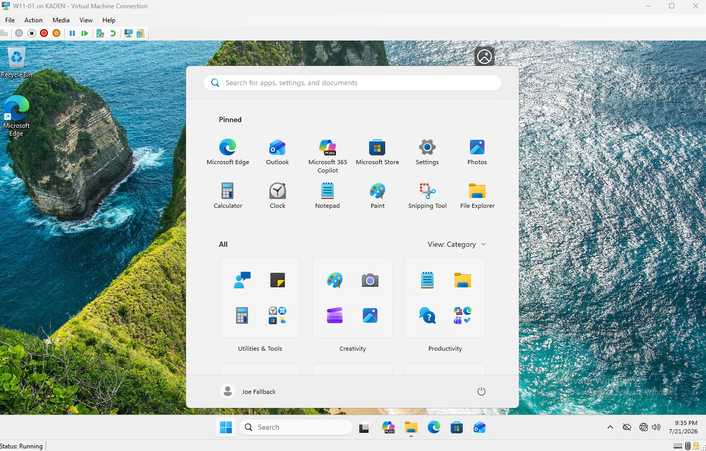

This section documents the standard procedure for resetting a domain user's password — the single most common help desk ticket in any organization. Performed twice in this lab: once during the [DC01 recovery](10-troubleshooting-log.md), and once here as a deliberate, documented runbook.

---

## Step 1: Verify Identity

Before touching any account, the requester's identity must be confirmed. This is the real security control in this procedure — everything after it is just execution.

### Why This Matters

An unverified password reset is a direct opening for **social engineering**: an attacker doesn't need to hack anything if they can convince the help desk to reset a password for them over the phone. This is a well-documented real-world attack pattern.

In a real organization, identity verification means confirming details only the real user would know (employee ID, manager's name, a pre-set security question) or routing the request through an authenticated channel (their logged-in employee portal, a callback to their known extension).

---

## Step 2: Locate the Account

### Instructions

Open **Active Directory Users and Computers** (`dsa.msc`).

Navigate to the correct OU — not the built-in `Users` container, which sits loose at the domain root, but the actual `Users` OU nested under the organization's structure:

```text

corp.kadenlab.test

└── KadenLab

    └── Users

```

**Note:** The domain has two objects both named "Users" — a built-in container at the domain root and the real OU nested under `KadenLab`. GPOs cannot link to the built-in container, and it should not hold real accounts. Always confirm the account's actual path, e.g. with `Get-ADUser <user> -Properties CanonicalName`, if there is any doubt.

Confirm the correct user is selected before proceeding — this closes the loop with Step 1 by matching the verified identity to the correct account object.

---

## Step 3: Perform the Reset

### Instructions

Right-click the user → **Reset Password**.

In the dialog:

- Enter a **New password** meeting the domain policy (14+ characters, complexity — see [Password and Lockout Policy](06-password-lockout-policy.md))

- Check **"User must change password at next logon"**

### Screenshot



### Why Check "Must Change at Next Logon"

The temporary password set by the technician should only work for a single login. Checking this box forces the user to immediately set their own new password, which only they know. The technician should never remain the only person who knows an account's ongoing password.

---

## Step 4: Verify the Reset

### Instructions

Right-click the user → **Properties** → **Account** tab. Confirm **"User must change password at next logon"** is checked under Account Options.

### Screenshot



---

## Step 5: Confirm End-to-End

The strongest verification is an actual login test, not just checking a flag in ADUC.

### Instructions

Log into a domain-joined client as the affected user with the temporary password. Windows should immediately present a **"You must change your password before signing in"** screen instead of the normal desktop.

Set a new password meeting the domain policy. A successful login to the desktop afterward — with no further prompts — confirms the reset worked correctly.

### Screenshot



---

## What I Learned

In this section, I learned that a password reset is not just "set a new password" — the real procedure starts with **identity verification**, which is the actual security control protecting against social engineering.

I learned to distinguish the built-in `Users` container from a real OU when locating an account, and confirmed the correct path with `Get-ADUser -Properties CanonicalName`.

I learned why "User must change password at next logon" should be checked for real resets: it ensures the technician does not remain the sole holder of the account's password.

I confirmed the reset end-to-end by logging in as the affected user, rather than only trusting the ADUC confirmation dialog.

---

Lab Overview · Related: [Troubleshooting Log](10-troubleshooting-log.md) · [Password and Lockout Policy](06-password-lockout-policy.md) · [Active Directory Setup](03-active-directory-setup.md)

---

[Home](../README.md) · Prev: [Drive Mapping Policy](07-drive-mapping-policy.md) · Next: [Offboarding Workflow](09-offboarding-workflow.md)

Related: [Troubleshooting Log](10-troubleshooting-log.md) · [Password and Lockout Policy](06-password-lockout-policy.md) · [Active Directory Setup](03-active-directory-setup.md)
