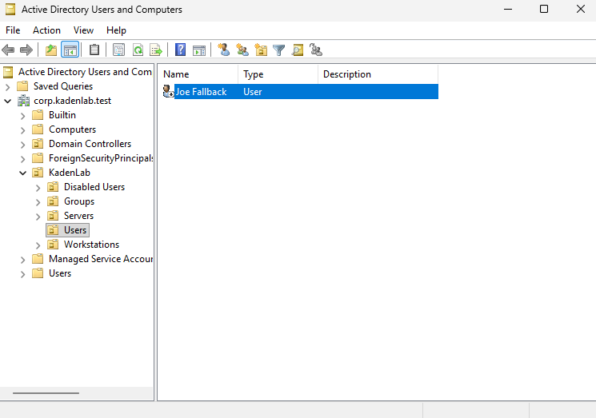
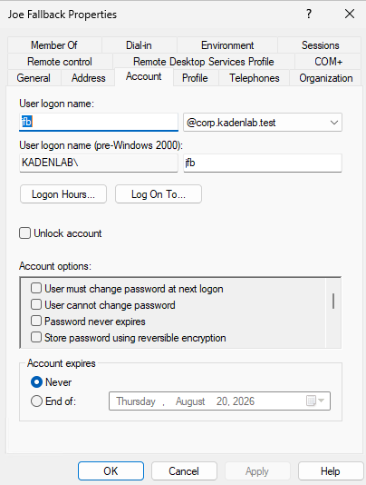
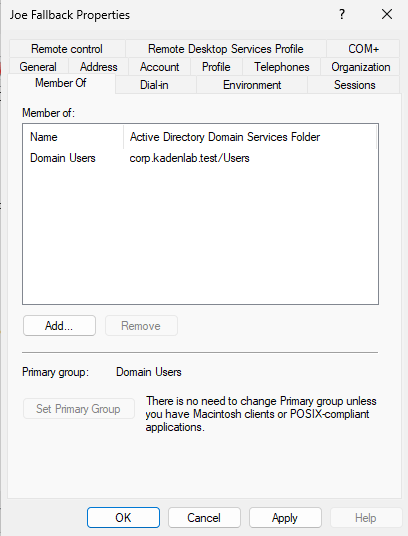
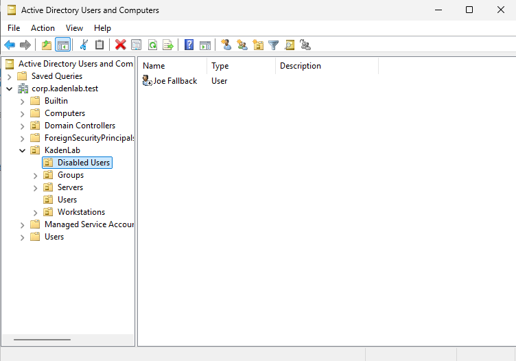

This section documents the standard procedure for offboarding a departing user's account. Unlike a password reset, offboarding balances two competing needs: cutting off access immediately (security) and preserving data and reversibility (business continuity). This is why the standard practice is **disable, don't delete.**

---

## Why Disable Instead of Delete

Deleting an account destroys its **SID** (the underlying unique identity object) permanently and irreversibly. This breaks file ownership history, orphans permissions, and cannot be undone.

Disabling instead:

- Cuts off login access **immediately**
- Is **fully reversible** (a mistake, or a rehire, is just a re-enable)
- **Preserves data** a manager or coworker may still need
- Preserves the account's audit trail

Standard real-world practice: **disable on the employee's last day, delete only after a retention period** (commonly 30–90 days, set by HR/legal/compliance policy).

---

## Step 1: Disable the Account

### Instructions

In **Active Directory Users and Computers**, locate the user in their OU. Right-click the user → **Disable Account**.

**Note:** Disabling blocks future logins immediately, but does not forcibly end a session already in progress. For an urgent/hostile termination, forcing logoff or locking the workstation is an additional step some organizations add.

### Verification

The user's icon in ADUC shows a down-arrow overlay, indicating a disabled account.

### Screenshot

---

## Step 2: Reset the Password

### Instructions

Right-click the user → **Reset Password**. Set a random password that is not written down or shared with anyone.

### Screenshot

### Why Reset a Password on an Already-Disabled Account

The disabled flag is the only thing currently blocking login — the old password itself still technically exists. If the account is ever accidentally re-enabled later (human error, a misconfigured bulk operation, a temporary business need), a still-valid old password would let the departed employee — or anyone they shared it with — log straight back in. Resetting the password removes that risk: even if the account is re-enabled by mistake, there is no working credential to get back in with.

---

## Step 3: Remove from Security Groups

### Instructions

Right-click the user → **Properties** → **Member Of** tab. Remove all groups that grant meaningful, resource-specific access (e.g. a group like `GG_IT_Users` tied to shares or software).

**Note:** The built-in `Domain Users` group cannot be removed directly if it is set as the account's primary group — Windows requires every account to have exactly one primary group. In practice this is not worth fighting: since the account is already disabled, no one can log in to exploit Domain Users membership regardless of whether it is removed. Real-world offboarding focuses on removing groups that grant _specific_ access, not on stripping the built-in primary group.

### Screenshot

---

## Step 4: Move to a Disabled/Offboarded OU

### Instructions

Right-click the user → **Move...** → select the `Disabled Users` OU → OK.

This visually separates disabled accounts from active employees and keeps them out of GPOs scoped to active users (e.g. the [Drive Mapping Policy](07-drive-mapping-policy.md), linked to the active `Users` OU).

### Screenshot

---

## Step 5: Data Handling (Awareness)

The account being disabled does not affect the user's files or mailbox — those exist independently on the file system / mail server. Standard practice: grant the departing employee's manager or a designated coworker delegated access to the mailbox, and reassign or grant NTFS permissions on their file-system data so nothing is lost when the account goes inactive.

---

## Step 6: Deletion Timeline (Awareness)

The account is not deleted immediately. Standard practice: **disable on the last day, hold for a retention period (commonly 30–90 days, set by HR/legal/compliance), then delete.** The hold window covers situations that surface after someone has left — a final pay dispute, a legal hold, or a need to recover something from their account or files. Only after the retention window closes is the account permanently deleted and its SID reclaimed.

---

## What I Learned

In this section, I learned that offboarding is not simply deleting an account — it balances immediate security (cutting off access) against reversibility and data preservation.

I learned why disabling is preferred over deleting: deletion destroys the SID permanently, while disabling is reversible and preserves the audit trail and any data tied to the account.

I learned the specific security reasoning for resetting a password on an already-disabled account: it protects against the account being accidentally re-enabled later with a still-valid old credential.

I confirmed hands-on that Windows will not let a primary group (typically `Domain Users`) be removed without first reassigning the primary group, and that in practice this is not worth pursuing once the account is disabled.

Finally, I learned the standard real-world pattern for data handling and deletion timing: reassign access to a manager/coworker, and hold the disabled account for a retention period (30–90 days) before actual deletion.

---

[Home](../README.md) · Prev: [Password Reset Runbook](08-password-reset-runbook.md) · Next: [Troubleshooting Log](10-troubleshooting-log.md)

Related: [Active Directory Setup](03-active-directory-setup.md) · [Drive Mapping Policy](07-drive-mapping-policy.md)
