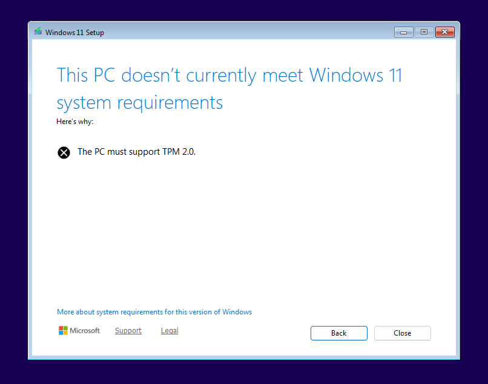
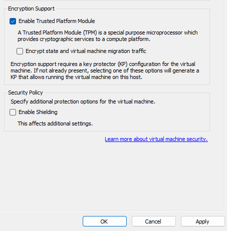

## Issue: Windows 11 VM TPM 2.0 Requirement

### Problem

The Windows 11 installer said the PC did not meet system requirements because TPM 2.0 was missing. This happened while installing Windows 11 on [W11-01](04-w11-01-setup.md).

### Fix

I turned the VM off, opened the settings for `W11-01`, went to the Security tab, and enabled Trusted Platform Module.

### Result

The Windows 11 installer was able to continue.




---

## Issue: Locked Out of Domain Administrator on DC01

### Problem

Domain administrator access to `DC01` was unavailable because the `KADENLAB\Administrator` password was not stored anywhere outside of memory. Initial triage also flagged two possible additional problems — that the lab VMs and the `AD-Lab-Switch` host adapter had been removed — which needed to be ruled out before addressing the credential issue itself.

### Diagnosis

Both additional concerns were ruled out first:

- `Get-VM` confirmed `DC01` and `W11-01` were both still **Running** (W11-01 showing ~20 hours of uptime) — no VMs had been removed.
- Deleting a VM in Hyper-V Manager only removes the VM configuration; it does **not** delete the `.vhdx` disk. Both disks were confirmed present in `C:\ProgramData\Microsoft\Windows\Virtual Hard Disks\`.
- A duplicate, empty `DC01` VM shell created during testing was identified and removed by its specific VM Id.
- The host adapter's IP (`10.10.10.1`) had in fact been removed, but this only affects the host's own NAT gateway, not authentication between the lab VMs.

With those ruled out, the confirmed root cause was the missing domain administrator credential.

### Fix

The domain administrator password was reset with an offline reset using the Windows Server ISO:

1. Attached the Server ISO to `DC01`'s DVD drive, set firmware to boot DVD first, and disabled Secure Boot so the VM would boot the recovery environment.
2. At the Windows Setup screen, pressed `Shift + F10` for a command prompt and confirmed the Windows volume letter with `diskpart` -> `list vol`.
3. Backed up `utilman.exe` and replaced it with `cmd.exe`:
   ```text
   copy C:\Windows\System32\utilman.exe C:\Windows\System32\utilman.exe.bak
   copy C:\Windows\System32\cmd.exe C:\Windows\System32\utilman.exe
   ```
4. Booted back to disk. The Ease of Access button on the login screen now opened a SYSTEM command prompt, and the password was reset with:
   ```text
   net user administrator *
   ```
5. **Restored** `utilman.exe` from the backup so the login-screen SYSTEM shell was closed:
   ```text
   copy C:\Windows\System32\utilman.exe.bak C:\Windows\System32\utilman.exe
   ```

The deleted host adapter was rebuilt by re-adding the `10.10.10.1` IP to `vEthernet (AD-Lab-Switch)`. The address stayed in a `Tentative` state due to a stale adapter record, and was fixed by disabling duplicate address detection:

```powershell
Set-NetIPInterface -InterfaceAlias "vEthernet (AD-Lab-Switch)" -DadTransmits 0
```

### Result

Domain administrator access was restored with **no rebuild** required. `Get-ADDomain` returned `corp.kadenlab.test` and all OUs, users, and GPOs were intact. The host adapter returned to `Preferred`.

### Prevention

- **Store credentials in a password manager rather than relying on memory alone.** The root cause here was a credential that existed in no other location.
- Deleting a VM in Hyper-V does not delete its disk -- **check for the `.vhdx` before rebuilding.**
- Console and boot access to a machine with an unencrypted disk allows a full credential reset. This is why domain controllers need physical security and full-disk encryption (BitLocker) -- the same offline reset is impossible if the disk is encrypted and the recovery key is unknown. (Relevant to Security+: physical security, boot/media control, full-disk encryption.)

---

[Home](../README.md) · Prev: [Offboarding Workflow](09-offboarding-workflow.md)

Related: [W11-01 Setup](04-w11-01-setup.md) · [Password and Lockout Policy](06-password-lockout-policy.md)
